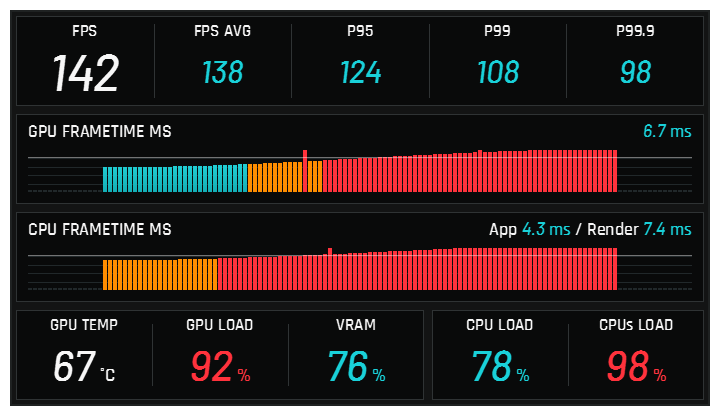

# XR Telemetry

An OpenXR API layer for Windows that gives you two ways to see what
your VR game is actually doing each frame: an **in-headset HUD** with
live FPS / frametimes / GPU+CPU load (head-locked or world-locked), and
a **per-frame CSV log**
covering every CPU and GPU segment of the OpenXR frame cycle. Both
features are independent — you can run either, both, or neither.

The layer sits between the game and the OpenXR runtime, so it works
across SteamVR / WMR / Oculus / Pimax / Varjo without per-runtime
patches. It never modifies the frame content the game submits; it only
observes timings and (optionally) composites its own quad on top.

## Install

Download the latest `Setup.exe` from
[Releases](https://github.com/mledour/OpenXR-Layer-XrTelemetry/releases)
and run it. The installer registers the layer under `HKLM` so every
OpenXR runtime on the machine picks it up, and creates an Add/Remove
Programs entry for clean uninstall.

The overlay (HUD) and the CSV log are both **off by default** — until
you enable at least one in `settings.json`, the layer is a pure
pass-through. See Settings below.

## Quickstart

1. Install via `Setup.exe`. It drops a default `settings.json` into
   `%LOCALAPPDATA%\XR_APILAYER_MLEDOUR_xr_telemetry\`.
2. Edit `settings.json` and flip `log.enabled = true` and/or
   `overlay.enabled = true`.
3. Launch your OpenXR game. With `log` on, a CSV appears in
   `…\sessions\` (one per OpenXR session). With `overlay` on, the
   HUD shows in the top-right of your FOV.

Prefer to keep both dormant and toggle from inside the game? Set
`mode = "hotkey"` on either feature, then press `Ctrl+Shift+T` (log)
or `Ctrl+Shift+O` (overlay) while the game has focus.

## Settings

The layer reads its configuration from
`%LOCALAPPDATA%\XR_APILAYER_MLEDOUR_xr_telemetry\`:

- **`settings.json`** — the global template. Edit this to change the
  defaults for future games.
- **`<app>_settings.json`** — auto-created the first time you run a
  given game, copied from the template. Lets you keep different
  settings per game (DCS, MSFS, iRacing, …) without them clashing.

Slug rules: spaces and special characters become `_`, uppercase is
lowered. `DiRT Rally 2.0` → `dirt_rally_2_0_settings.json`.

Full schema:

```json
{
  "log": {
    "enabled": false,
    "mode": "auto",
    "hotkey": { "key": "T", "modifiers": ["ctrl", "shift"] }
  },
  "overlay": {
    "enabled": false,
    "mode": "auto",
    "hotkey": { "key": "O", "modifiers": ["ctrl", "shift"] },
    "refresh_hz": 10,
    "position": "head_top_right",
    "scale": 1.0,
    "anchor": "head",
    "offset_x": 0.0,
    "offset_y": 0.0
  }
}
```

The parser is permissive — missing keys, wrong types, unknown enum
values all fall back to the documented defaults silently rather than
disabling the feature, so a typo never kills your session.

---

## Overlay

The overlay is a HUD in a corner of your FOV, two-column fpsVR-style
layout. By default it's **head-locked** — it follows your view and
stays in the same spot. You can also pin it **world-locked** so it
freezes in the room in front of you (see `anchor` below).



### What's displayed

| Row | Field | Meaning |
|---|---|---|
| Header | **FPS** | Instant frame rate from the last frame's duration (`1e9 / frame_total_ns`). White, the eye-catcher. |
| Header | **FPS AVG** | Mean FPS over the refresh window (10 Hz by default). |
| Header | **P95** | 95 % of frames hit at least this FPS — the slow 5 % drop below. Sliding 30 s window. |
| Header | **P99** | 99 % of frames hit at least this FPS. The worst 1 % drop below. |
| Header | **P99.9** | The single worst ~0.1 % — typically a handful of specific spike frames in the window. Matches fpsVR / SteamVR "Frame Timing" convention. |
| GPU Frametime ms | **`6.7 ms`** + bars | Mean GPU time spent on the app's `xrBeginFrame → xrEndFrame` draws over the refresh window. Bars: 120-sample rolling histogram, one bar per frame. Y axis spans `0..2× period`; the white midline marks the budget. |
| CPU Frametime ms | **`App X.X ms / Render Y.Y ms`** + bars | **App** = wait→end window (`app_cpu_ns` — render submission + housekeeping). **Render** = full per-cycle CPU (`frame_total - wait_block` — includes game sim / physics / input poll BETWEEN frames). The gap between them is the work `App` alone can't see. |
| Bottom | **GPU TEMP** | Temperature in °C from the active GPU sensor. |
| Bottom | **GPU LOAD** | Utilisation % derived from `gpu_headroom_pct`. Cyan < 80 %, orange 80–89 %, red ≥ 90 %. |
| Bottom | **VRAM** | `vram_used / vram_budget` as a %. Same tier colours as GPU LOAD. |
| Bottom | **CPU LOAD** | Per-cycle CPU utilisation % derived from `headroom_pct` (the app's CPU work vs. the frame budget — distinct from the system-wide **CPUs LOAD** reading). Same tier colours as GPU LOAD. |
| Bottom | **CPUs LOAD** | Utilisation % of the **busiest logical processor** (fpsVR's "CPUs"). Sampled system-wide via a documented user-mode NT call (`NtQuerySystemInformation`) — no driver, no elevation. A high **CPUs LOAD** next to a tame **CPU LOAD** is the classic single-thread-bound signature most VR titles hit. `--` only when the sampler couldn't initialise. Same tier colours as GPU LOAD. |

**Bar colour code** (per-sample, not overall):

| Colour | When |
|---|---|
| Cyan / blue gradient | Frametime ≤ 80 % of the runtime's predicted display period |
| Orange | 80 – 100 % of budget — close to missing the deadline |
| Red | ≥ 100 % — frame busted the budget. Reprojected / stuttered frames cross the white midline. |

The budget is anchored, not auto-normalised — a single spike won't
squash the rest of the bars, and a stretch where every bar is red
honestly means "you're busting every frame here" (e.g. a 60 Hz menu
cap on a 90 Hz HMD).

### Settings — `overlay.*`

| Field | Type | Default | Meaning |
|---|---|---|---|
| `enabled` | bool | `false` | Master switch. The HUD never paints uninvited — opt in via this flag, or summon it temporarily via the hotkey (see below). |
| `mode` | string | `"auto"` | `auto` = HUD visible the whole session when `enabled=true`. `hotkey` = HUD hidden until the user presses the combo, toggles on/off on each subsequent press. |
| `hotkey.key` | string | `"O"` | Main key. Recognised: `A`–`Z`, `0`–`9`, `F1`–`F24`, `Space`, `Tab`, `Enter`, `Escape`, `Backspace`, `Insert`, `Delete`, `Home`, `End`, `PageUp`, `PageDown`, `Up`, `Down`, `Left`, `Right`. Punctuation is intentionally unsupported (locale-dependent). |
| `hotkey.modifiers` | string[] | `["ctrl", "shift"]` | Modifiers required IN ADDITION to the main key. Recognised: `ctrl`, `shift`, `alt`, `win`. Must match exactly — `Ctrl+Alt+Shift+O` does NOT trigger a `Ctrl+Shift+O` binding. |
| `refresh_hz` | int | `10` | How often the displayed numbers update. Clamped to `[1, 60]`. 10 Hz matches fpsVR — fast enough that the numbers track reality, slow enough to be readable in motion. |
| `position` | string | `"head_top_right"` | Corner of the FOV. Recognised: `head_top_right`, `head_top_left`, `head_top_center`, `head_center`. Anything else falls back to `head_top_right`. With `anchor: "world"` this picks where the panel lands at the moment it's summoned. |
| `scale` | float | `1.0` | Multiplier on the default quad size. Clamped to `[0.5, 2.0]`. |
| `offset_x` | float | `0.0` | Fine-tune the HUD's horizontal placement, in metres at the 1 m quad distance, on top of `position`. `+` = right, `−` = left. The stock corner already hugs the edge; use this to push it further out (or back toward centre) without a rebuild. Clamped to `[-1.0, 1.0]`. |
| `offset_y` | float | `0.0` | Same as `offset_x` but vertical: `+` = up, `−` = down. Clamped to `[-1.0, 1.0]`. |
| `anchor` | string | `"head"` | Reference frame. `head` = the HUD is attached to the headset and follows your gaze (the stock behaviour). `world` = the HUD freezes in the play space in front of you the moment it turns on and stays there as you move and look around. It always hangs **upright** — a tilted head when it's summoned won't leave it pitched or rolled — but you aim its **height with your gaze**: look up as you summon it and it anchors higher, look down and it anchors lower. To re-centre a world-locked HUD, toggle it off and on again (auto mode: it re-anchors at the start of each session; hotkey mode: each time you press the combo to summon it). If the headset isn't tracking when it's summoned the panel waits for tracking, and falls back to head-locked after a couple of seconds rather than never appearing. Anything other than `world` falls back to `head`. |

**Graphics-API support.** D3D11 hosts paint the HUD with GPU shaders (a
prebuilt glyph atlas + instanced quads) straight into a BGRA8 swapchain.
D3D12 hosts go through D3D11On12 so those same D3D11 shaders can render
directly into the D3D12 swapchain image.
**Vulkan and OpenGL hosts are not supported** — the layer logs
`overlay disabled — Vulkan/OpenGL hosts not supported by the renderer`
and the CSV-logging path keeps running.

**Hotkey caveats.** Hotkeys are polled inside `xrEndFrame` (game must
have focus + be rendering). On European AZERTY / QWERTZ keyboards
AltGr reports as `Ctrl + Alt`, so a `Ctrl + letter` binding will also
fire on `AltGr + letter` — prefer `Shift + F-key` if you hit this.
The layer does NOT consume key presses (no `RegisterHotKey`), so a
game binding on the same combo will fire alongside the layer toggle;
pick a combo your game doesn't claim, or add `alt` to push into the
under-used `Ctrl+Alt+Shift+letter` range.

---

## Logs

The layer writes one CSV row per frame, capturing every CPU + GPU
segment of the OpenXR frame cycle. Files live at:

```
%LOCALAPPDATA%\XR_APILAYER_MLEDOUR_xr_telemetry\sessions\
    YYYY-MM-DD_HH-MM-SS.mmmZ_<AppName>.csv
```

One file per session in `auto` mode, one file per recording window in
`hotkey` mode. Openable directly in Excel / Pandas / LibreOffice.
Pandas reads the footer transparently with `pd.read_csv(path,
comment='#')`.

### Sample

```csv
frame,timestamp_qpc,wait_block_ns,pre_begin_ns,app_cpu_ns,end_frame_ns,frame_total_ns,gpu_time_ns,period_ns,headroom_pct,gpu_headroom_pct,should_render,gpu_temp_c,vram_used_bytes,vram_budget_bytes,cpus_max_pct
0,18452119837601,0,153244,6041122,287413,0,0,11111111,100.00,100.00,1,67.5,6079217664,8589934592,nan
1,18452121034711,3128905,148902,6112874,294118,11969012,5183047,11111111,20.31,53.35,1,67.5,6079217664,8589934592,96.2
2,18452122156388,3204711,151088,6088423,289776,11217677,5198114,11111111,27.84,53.21,1,67.6,6079217664,8589934592,95.8
3,18452123277014,3198044,149837,6094811,291204,11206264,5179420,11111111,27.94,53.38,1,67.6,6079217664,8589934592,97.1
4,18452124398211,3187621,150412,6097104,290847,11212197,5191388,11111111,27.89,53.27,1,67.6,6086217728,8589934592,96.5
5,18452125519988,3175102,152017,6105844,293012,11221777,5208112,11111111,27.80,53.12,1,67.7,6086217728,8589934592,95.9
…
# session_end written=8124 dropped_try_lock=0 dropped_queue_full=0 dropped_disk_write=0
```

The trailing `# session_end` footer records the total rows written and
per-cause drop counters (a frame may be skipped if the writer thread
falls behind, but in practice drops are zero on healthy hardware).

### Fields

| Column | Definition | What it captures |
|---|---|---|
| `frame` | Sequential 0-based counter | Frame index since the session start. |
| `timestamp_qpc` | `QueryPerformanceCounter` ticks at `xrEndFrame` entry | Frame-end wall clock. Convert to seconds by dividing by `QueryPerformanceFrequency` (typically ~10 MHz on modern Windows hosts). |
| `wait_block_ns` | `tWaitOut − tWaitIn` | **Compositor throttle.** Time the runtime made the app wait inside `xrWaitFrame`. Big = compositor has headroom and is rate-limiting the app (good). Small = app is the bottleneck. |
| `pre_begin_ns` | `tBegin − tWaitOut` | **Housekeeping.** Time between `xrWaitFrame` returning and `xrBeginFrame` being called — input poll, state update. Usually ~50–300 µs. |
| `app_cpu_ns` | `tEnd − tWaitOut` | **Wait→End window** = `pre_begin_ns` + render submission. CPU time the app spent between `xrWaitFrame` returning and `xrEndFrame` being called — render-thread heaviness. |
| `end_frame_ns` | Duration of the downstream `xrEndFrame` call | **Runtime/compositor ingest overhead.** Layer composition, projection correction, compositor handoff. On mature runtimes (SteamVR / Oculus) typically a few hundred µs; on young runtimes can reach 1–2 ms. |
| `frame_total_ns` | `tEnd_now − tEnd_prev` | **Full cycle duration.** End-to-end wall clock of the previous frame. Includes the post-`xrEndFrame` work (sim, physics, AI, input polling) that `app_cpu_ns` can't see because it happens AFTER the app returns and BEFORE the next `xrWaitFrame`. `0` on the first frame. |
| `gpu_time_ns` | GPU timestamp delta from `xrBeginFrame` to `xrEndFrame` | **App GPU work for this frame.** D3D11: `D3D11_QUERY_TIMESTAMP` bracketed by a `D3D11_QUERY_TIMESTAMP_DISJOINT` for frequency validation. D3D12: native `D3D12_QUERY_TYPE_TIMESTAMP` on the layer's own short command lists (no D3D11On12 wrapping). `0` for Vulkan / OpenGL hosts (not instrumented) and for the first ~4 frames (async-query warmup). |
| `period_ns` | `XrFrameState.predictedDisplayPeriod` | Target frame budget reported by the runtime. ~11.11 ms @ 90 Hz, ~8.33 ms @ 120 Hz, ~13.89 ms @ 72 Hz. Constant for a given session. |
| `headroom_pct` | `(1 − (frame_total_ns − wait_block_ns) / period_ns) × 100` | **CPU % of the frame budget NOT spent on app CPU work this cycle.** Matches fpsVR / OpenXR Toolkit semantics. Negative ⇒ CPU-bound. Falls back to `(1 − app_cpu_ns / period_ns) × 100` on the first frame. Reads `100.00` when `period_ns == 0` (transient at session start) — filter on `period_ns > 0` to exclude. |
| `gpu_headroom_pct` | `(1 − gpu_time_ns / period_ns) × 100` | **GPU % of the frame budget NOT spent on app GPU work this cycle.** Negative ⇒ GPU-bound. `100.00` when `gpu_time_ns == 0` (no D3D binding, disjoint range invalid, query not yet ready) — filter on `gpu_time_ns > 0` to exclude unmeasured rows. |
| `should_render` | `XrFrameState.shouldRender` as 0/1 | Whether the runtime asked the app to render this frame. `0` = skipped (focus loss, scene transition). Typically filtered out for steady-state analysis. |
| `gpu_temp_c` | GPU temperature in °C, 1 decimal | Latched at the snapshot's refresh cadence. `nan` (pandas reads as `np.nan`) if the GPU vendor's sensor path is unavailable. |
| `vram_used_bytes` | GPU dedicated memory currently allocated, bytes | From DXGI's local-memory budget query. `0` if the query failed. |
| `vram_budget_bytes` | OS-suggested VRAM budget for the process, bytes | From the same DXGI query. The renderer uses this for the bottom-row VRAM percentage (`used / budget`). |
| `cpus_max_pct` | Busiest logical processor's utilisation %, 1 decimal | The overlay's **CPUs LOAD**. Latched at the sampler's ~1 Hz poll cadence (system-wide, via `NtQuerySystemInformation`). `nan` until the first reading and on hosts where the sampler couldn't initialise. A high `cpus_max_pct` with a tame `headroom_pct` is the single-thread-bound signature. |

### Anatomy of a frame cycle

Stitched chronologically, the CPU columns cover 100 % of the cycle.
The GPU column runs in parallel — the GPU processes the app's draws
while the CPU has already moved on to the next frame's sim work:

```
CPU timeline:

xrEndFrame_prev ↓
                ├──────── post_end ────────────┐
                                               ↓
                                          xrWaitFrame ↓
                                          ├ wait_block ┤
                                                       ↓
                                              ├ pre_begin ┤
                                                          ↓ xrBeginFrame
                                              ├ render_submission ┤
                                                                  ↓ xrEndFrame ↓
                                                                  ├ end_frame ┤
                                                                              ↓
                ←──────────────────── frame_total ────────────────────────────→


GPU timeline (parallel, may overlap with the next CPU frame):

                                              xrBeginFrame ↓
                                                        ├──── gpu_time ───┤
                                                                          ↓ xrEndFrame
```

Two derived segments aren't stored as their own columns — compute them
in analysis when you need them:

- `render_submission_ns = app_cpu_ns − pre_begin_ns`
  — time the app spent inside `xrBeginFrame → xrEndFrame` submitting
  draw calls. Heavy submission paths (lots of draws, state changes,
  GPU-queue stalls) light this up.
- `post_end_ns = frame_total_ns − wait_block_ns − pre_begin_ns − app_cpu_ns − end_frame_ns`
  — time spent OUTSIDE OpenXR calls (game simulation, physics, AI,
  scripting, event polling). `app_cpu_ns` alone can't see this — it
  only covers the wait→end window.

### Diagnostic patterns

| Symptom | Where to look | Reading |
|---|---|---|
| App feels stuttery | `frame_total_ns > period_ns × 1.5` rows | Missed deadlines. Drill into which segment dominates. |
| **CPU-bound vs GPU-bound** | Average `headroom_pct` vs `gpu_headroom_pct` | Whichever is **lower** is your bottleneck. Both low + similar = balanced at the limit, optimise both. Only CPU low = simplify sim / submission. Only GPU low = drop shader complexity / resolution. |
| Render-thread heavy | `app_cpu_ns − pre_begin_ns` close to `period_ns` | Too many draw calls / state changes / GPU-queue stalls. Profile with PIX / RenderDoc. |
| Sim heavy | `frame_total_ns − wait_block_ns − app_cpu_ns − end_frame_ns` dominates | Physics / AI / scripting between frames is the bottleneck — game-logic thread, not the renderer. |
| Runtime overhead | `end_frame_ns > ~1 ms` consistently | The runtime itself is slow ingesting frames. Switching runtimes (SteamVR ↔ Oculus ↔ vendor) usually moves this number. |
| Healthy session | `wait_block_ns ≈ period_ns × 0.3`, `frame_total_ns ≈ period_ns` | App finishes early, runtime throttles, equilibrium. |

GPU timestamps are asynchronous — a query issued at `xrBeginFrame_N`
returns 1–3 frames later, so the layer **defers each row by ~3–4
frames** to keep `gpu_time_ns` aligned with its own `frame_index`. The
last ~4 rows of a session flush with `gpu_time_ns = 0` because the GPU
result wasn't ready at shutdown — filter on `gpu_time_ns > 0` before
computing GPU averages.

### Settings — `log.*`

| Field | Type | Default | Meaning |
|---|---|---|---|
| `enabled` | bool | `false` | Master switch for the CSV. `false` (the default) skips writing entirely; combined with `overlay.enabled=false` (also the default), the layer is a pure pass-through. |
| `mode` | string | `"auto"` | `auto` = one CSV per session, opened at session start and closed at session end. `hotkey` = no CSV until the user presses the combo; each press starts/stops a recording window (one fresh file per window — short sessions don't merge into one giant log). |
| `hotkey.key` | string | `"T"` | Main key. Same set of recognised names as the overlay hotkey. |
| `hotkey.modifiers` | string[] | `["ctrl", "shift"]` | Modifiers. Same set as the overlay hotkey. |

The two hotkeys default to **different combos** (`Ctrl+Shift+O` for
the overlay, `Ctrl+Shift+T` for the log) so users running both in
hotkey mode can drive them independently without a chord collision.
Every transition is logged (`xr_telemetry: hotkey pressed — log
RECORDING/STOPPED`) so support sessions can see when the user thought
they started or stopped something.

### Settings are read once

The settings file is parsed at `xrCreateInstance` and stays cached for
the rest of the session — no filewatch reload. A filewatch adds steady
jitter to the frame loop (we observed this on the sibling `fov_crop`
layer's `live_edit` flag), and the whole point of `xr_telemetry` is to
measure frame timings — polluting the measurement with its own
bookkeeping defeats the purpose. **Restart the game** to apply a new
settings file.

## License

MIT — see [LICENSE](./LICENSE).

The framework code (`openxr-api-layer/framework/`, the dispatch
generator, `module.def`, the entry point, the logging helpers) is the
work of Matthieu Bucchianeri (`mbucchia`), Copyright © 2022-2023, and
ships under his MIT terms alongside ours.

The two bundled fonts (`Rajdhani-SemiBold.ttf`, `Barlow-MediumItalic.ttf`)
are licensed under the SIL Open Font License v1.1 — see
[`openxr-api-layer/fonts/OFL.txt`](./openxr-api-layer/fonts/OFL.txt).
